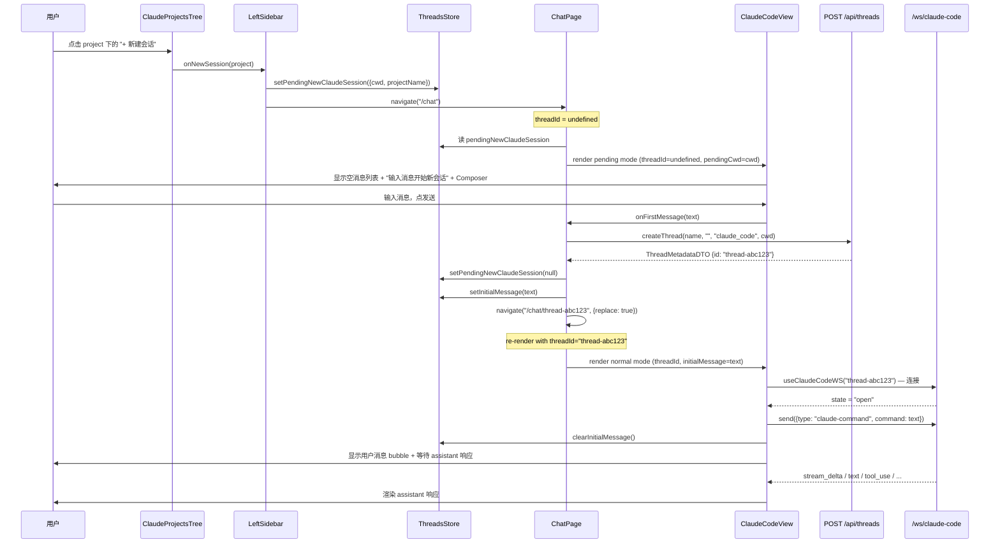
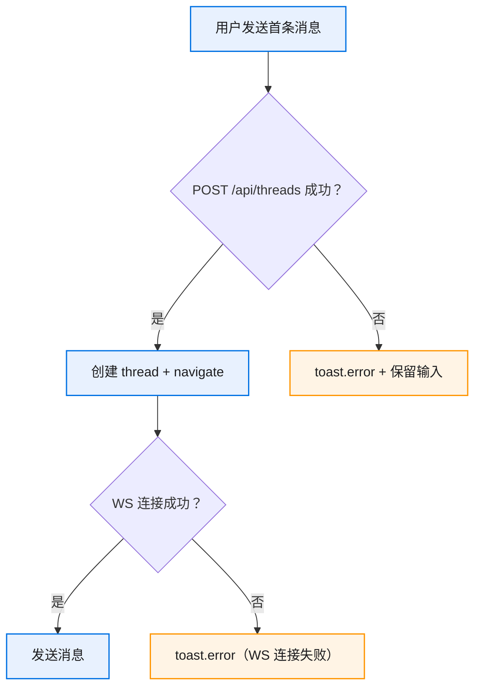

# 核心流程

## 主链路：从按钮到消息发出

```mermaid
sequenceDiagram
    participant U as 用户
    participant CT as ClaudeProjectsTree
    participant LS as LeftSidebar
    participant Store as ThreadsStore
    participant CP as ChatPage
    participant CV as ClaudeCodeView
    participant API as POST /api/threads
    participant WS as /ws/claude-code

    U->>CT: 点击 project 下的 "+ 新建会话"
    CT->>LS: onNewSession(project)
    LS->>Store: setPendingNewClaudeSession({cwd, projectName})
    LS->>CP: navigate("/chat")

    Note over CP: threadId = undefined
    CP->>Store: 读 pendingNewClaudeSession
    CP->>CV: render pending mode (threadId=undefined, pendingCwd=cwd)
    CV->>U: 显示空消息列表 + "输入消息开始新会话" + Composer

    U->>CV: 输入消息，点发送
    CV->>CP: onFirstMessage(text)
    CP->>API: createThread(name, "", "claude_code", cwd)
    API-->>CP: ThreadMetadataDTO {id: "thread-abc123"}
    CP->>Store: setPendingNewClaudeSession(null)
    CP->>Store: setInitialMessage(text)
    CP->>CP: navigate("/chat/thread-abc123", {replace: true})

    Note over CP: re-render with threadId="thread-abc123"
    CP->>CV: render normal mode (threadId, initialMessage=text)
    CV->>WS: useClaudeCodeWS("thread-abc123") — 连接
    WS-->>CV: state = "open"
    CV->>WS: send({type: "claude-command", command: text})
    CV->>Store: clearInitialMessage()
    CV->>U: 显示用户消息 bubble + 等待 assistant 响应
    WS-->>CV: stream_delta / text / tool_use / ...
    CV->>U: 渲染 assistant 响应
```

## 错误分支

```mermaid
flowchart TD
    classDef p0 fill:#E8F1FE,stroke:#0071E3,color:#1D1D1F,stroke-width:1.5px
    classDef err fill:#FFF4E5,stroke:#FF9500,color:#1D1D1F,stroke-width:1.5px

    A["用户发送首条消息"]:::p0
    B{"POST /api/threads 成功？"}
    C["创建 thread + navigate"]:::p0
    D["toast.error + 保留输入"]:::err
    E{"WS 连接成功？"}
    F["发送消息"]:::p0
    G["toast.error（WS 连接失败）"]:::err

    A --> B
    B -->|是| C --> E
    B -->|否| D
    E -->|是| F
    E -->|否| G
```

**错误恢复策略**：
- thread 创建失败 → toast 报错，不清除 pending state，用户可重试
- WS 连接失败 → thread 已创建但消息未发出，URL 已更新。用户在新页面重新输入即可（ClaudeCodeView 正常模式会重试 WS）
