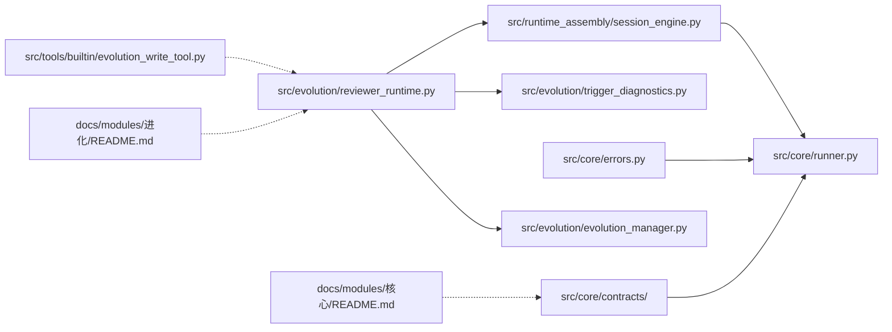

# evolution-reviewer-tool-call-guard · 影响边界图

```mermaid
flowchart LR
  EvoReviewer["src/evolution/reviewer_runtime.py"]
  SessionEngine["src/runtime_assembly/session_engine.py"]
  Contracts["src/core/contracts/"]
  CoreErrors["src/core/errors.py"]
  Runner["src/core/runner.py"]
  TriggerDiagnostics["src/evolution/trigger_diagnostics.py"]
  EvolutionManager["src/evolution/evolution_manager.py"]
  EvolutionWrite["src/tools/builtin/evolution_write_tool.py"]
  CoreDocs["docs/modules/核心/README.md"]
  EvolutionDocs["docs/modules/进化/README.md"]

  EvoReviewer --> SessionEngine --> Runner
  Contracts --> Runner
  CoreErrors --> Runner
  EvoReviewer --> TriggerDiagnostics
  EvoReviewer --> EvolutionManager
  EvolutionWrite -.-> EvoReviewer
  CoreDocs -.-> Contracts
  EvolutionDocs -.-> EvoReviewer
```
