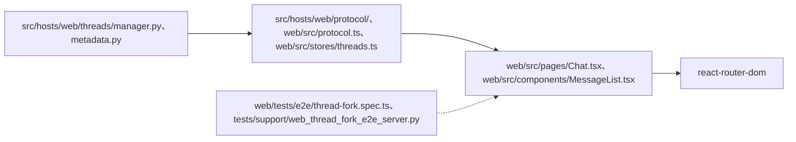

# fork-lineage-navigation · 影响边界图

```mermaid
flowchart LR
  Persistence["src/hosts/web/threads/manager.py、metadata.py"]
  Upstream["src/hosts/web/protocol/、web/src/protocol.ts、web/src/stores/threads.ts"]
  Target["web/src/pages/Chat.tsx、web/src/components/MessageList.tsx"]
  Downstream["react-router-dom"]
  Related["web/tests/e2e/thread-fork.spec.ts、tests/support/web_thread_fork_e2e_server.py"]

  Persistence --> Upstream --> Target --> Downstream
  Related -.-> Target
```
