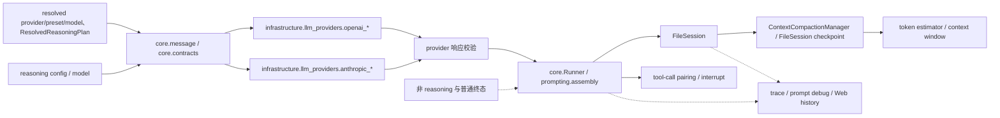

# 05-runner-validation-gate · 影响边界图

```mermaid
flowchart LR
  Catalog["resolved provider/preset/model、ResolvedReasoningPlan"]
  CoreMsg["core.message / core.contracts"]
  OpenAI["infrastructure.llm_providers.openai_*"]
  Anthropic["infrastructure.llm_providers.anthropic_*"]
  Validate["provider 响应校验"]
  Sessions["FileSession"]
  Runner["core.Runner / prompting.assembly"]
  Compaction["ContextCompactionManager / FileSession checkpoint"]
  TokenEst["token estimator / context window"]
  ToolPair["tool-call pairing / interrupt"]
  ReasonCfg["reasoning config / model"]
  Trace["trace / prompt debug / Web history"]
  Terminal["非 reasoning 与普通终态"]

  Catalog --> CoreMsg
  ReasonCfg --> CoreMsg
  CoreMsg --> OpenAI
  CoreMsg --> Anthropic
  OpenAI --> Validate
  Anthropic --> Validate
  Validate --> Runner
  Runner --> Sessions
  Runner --> ToolPair
  Sessions --> Compaction
  Compaction --> TokenEst
  Runner -.-> Trace
  Sessions -.-> Trace
  Terminal -.-> Runner
```
