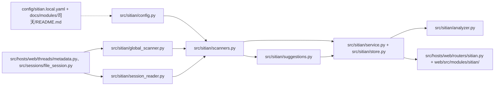

# generic-chat-session-analysis · 影响边界图

```mermaid
flowchart LR
  Sources["src/hosts/web/threads/metadata.py、src/sessions/file_session.py"]
  Config["src/sitian/config.py"]
  Global["src/sitian/global_scanner.py"]
  Reader["src/sitian/session_reader.py"]
  Scanner["src/sitian/scanners.py"]
  Suggest["src/sitian/suggestions.py"]
  Service["src/sitian/service.py + src/sitian/store.py"]
  Analyzer["src/sitian/analyzer.py"]
  Report["src/hosts/web/routers/sitian.py + web/src/modules/sitian/"]
  Docs["config/sitian.local.yaml + docs/modules/司天/README.md"]

  Sources --> Global
  Sources --> Reader
  Config --> Scanner
  Global --> Scanner
  Reader --> Scanner
  Scanner --> Service
  Scanner --> Suggest
  Suggest --> Service
  Service --> Analyzer
  Service --> Report
  Docs -.-> Config
```
