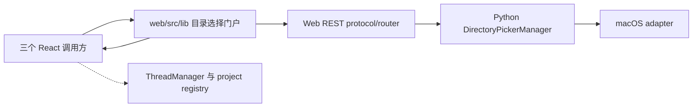

# web-browser-directory-picker-v0.1-full · 影响边界图

```mermaid
flowchart LR
  Callers["三个 React 调用方"]
  Frontend["web/src/lib 目录选择门户"]
  Rest["Web REST protocol/router"]
  Manager["Python DirectoryPickerManager"]
  MacOS["macOS adapter"]
  Business["ThreadManager 与 project registry"]

  Callers --> Frontend --> Rest --> Manager --> MacOS
  Frontend --> Callers
  Callers -.-> Business
```
